# Карточки выпуска «Взлетели на GitHub»

11 готовых картинок для карусели: обложка и 10 проектов. PNG 1080×1920, вертикаль 9:16.

**Как сохранить на телефон:** зажми картинку пальцем → «Сохранить изображение».
Порядок загрузки в карусель — сверху вниз.

Нижние 340 px каждой карточки намеренно пустые: там интерфейс TikTok.

---

### Обложка

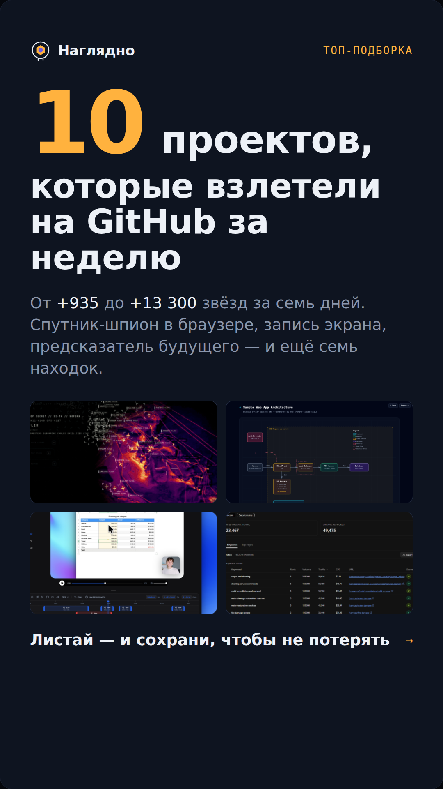

### 01 / 10 — gods-eye-view

Спутник-шпион в браузере.

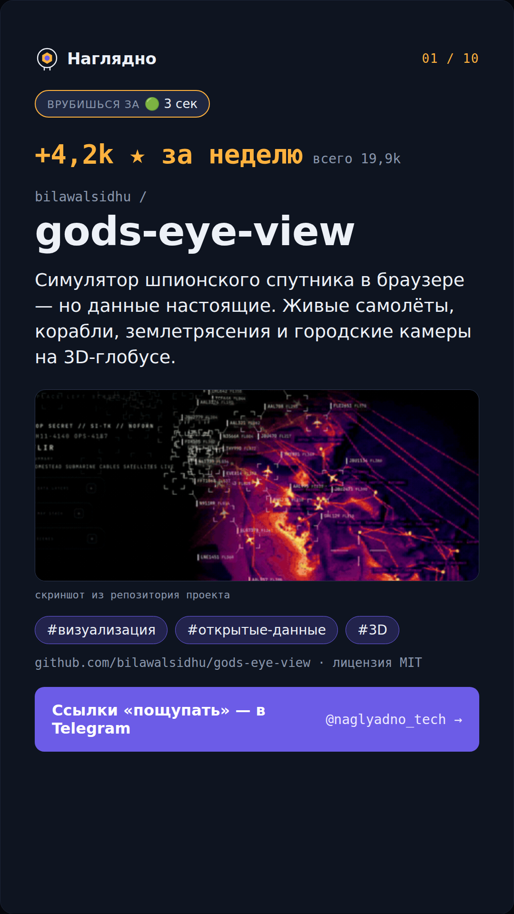

### 02 / 10 — Recordly

Запись экрана.

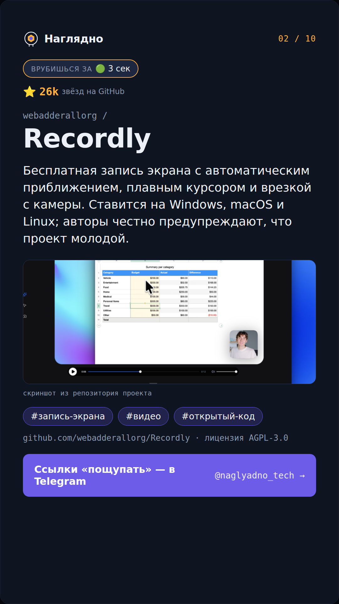

### 03 / 10 — hyperframes

HTML превращается в видео.

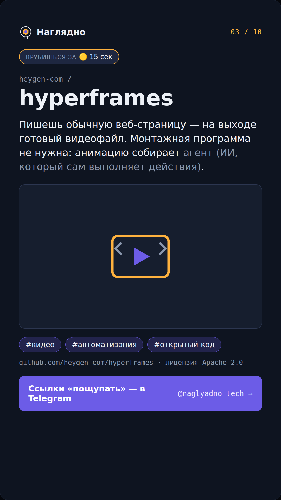

### 04 / 10 — archify

Схемы из обычного описания.

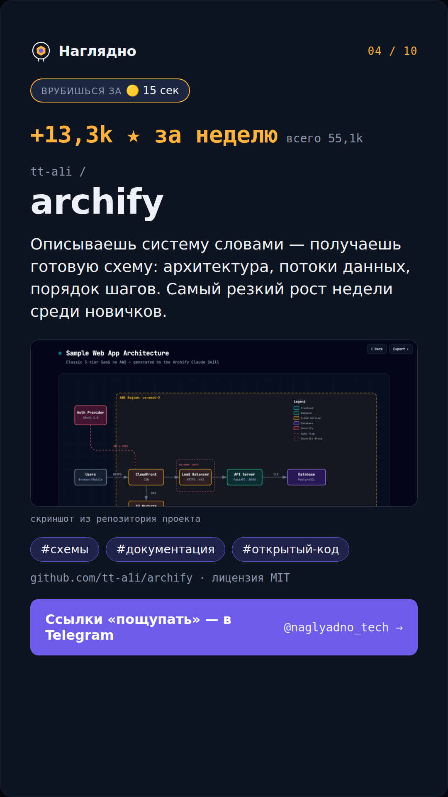

### 05 / 10 — markitdown

Документы в текст для нейросети.

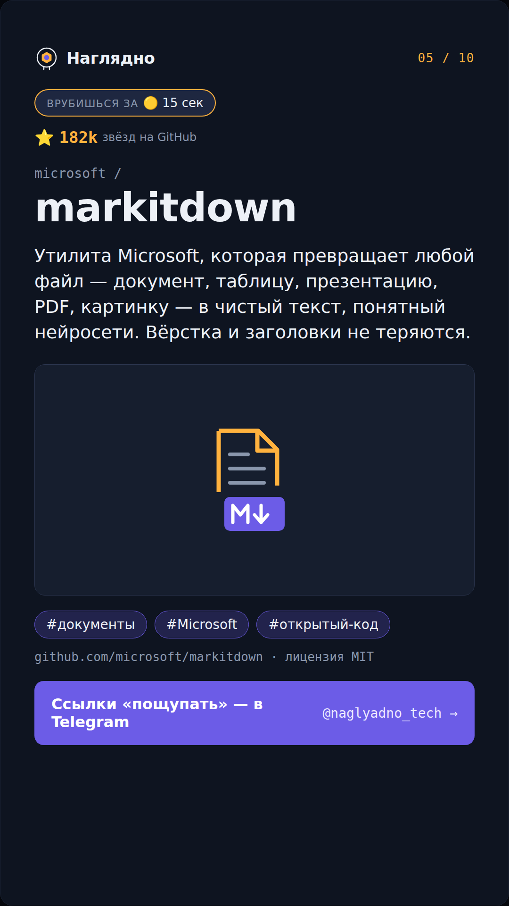

### 06 / 10 — humanizer

Убирает следы нейросети из текста.

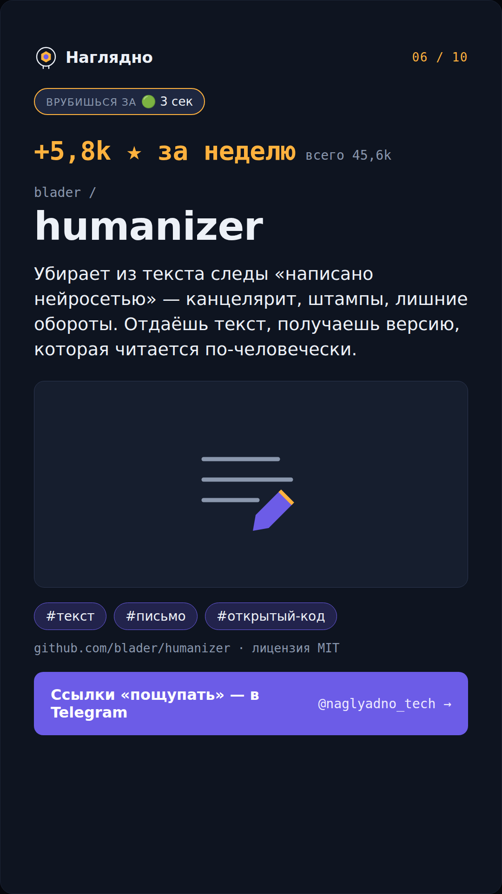

### 07 / 10 — open-seo

Замена Semrush и Ahrefs.

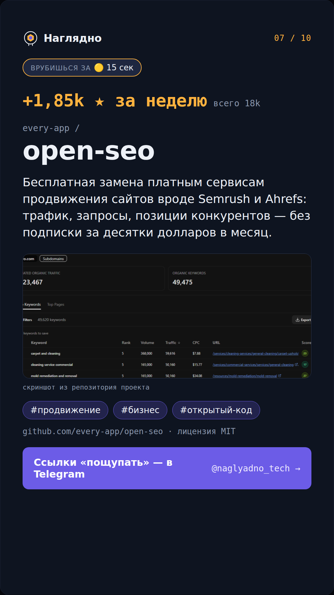

### 08 / 10 — timesfm

Прогноз по числовому ряду.

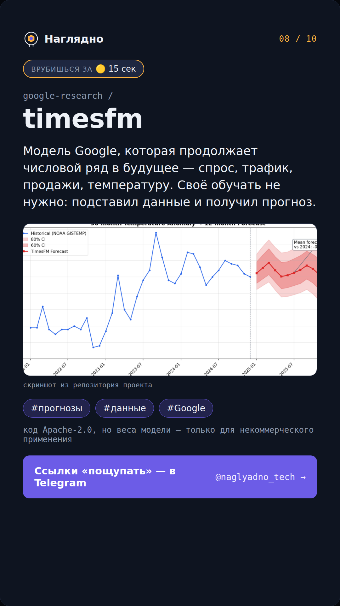

### 09 / 10 — chrome-devtools-mcp

ИИ управляет браузером.

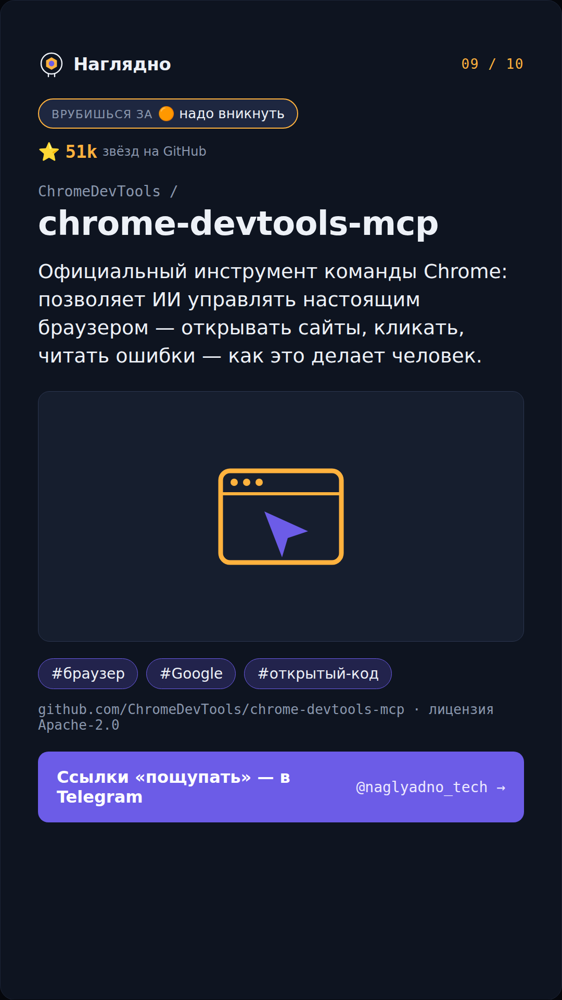

### 10 / 10 — context-mode

Память ИИ-помощника.

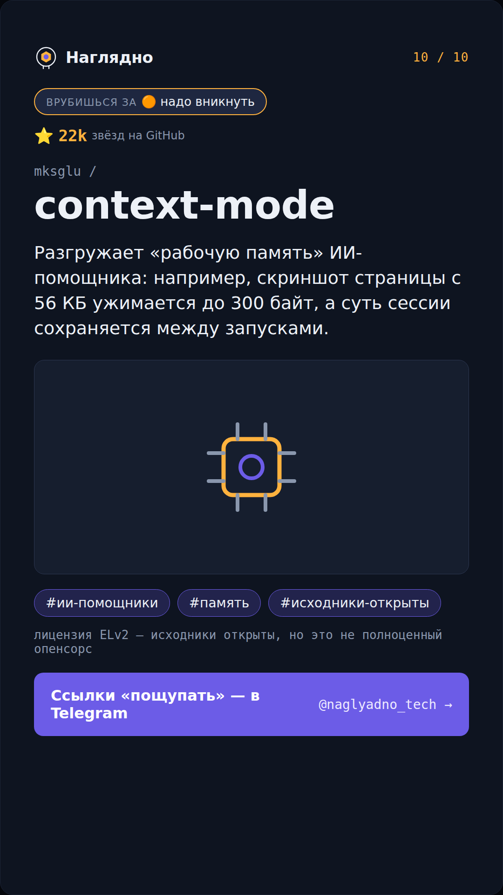
